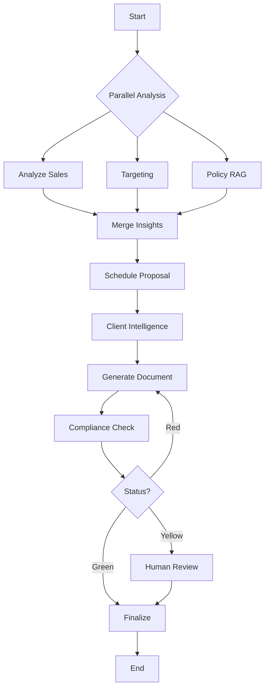

# Startup Manager - AI-Powered Business Automation Platform

영업/마케팅 팀을 위한 AI 기반 업무 자동화 플랫폼

## 🚀 Overview

LangGraph 0.6.6 기반의 최신 워크플로우 오케스트레이션을 활용한 엔터프라이즈 업무 자동화 시스템입니다.

### 주요 기능
- 📊 **실적 분석**: KPI 자동 계산 (YoY, YTD, 달성률)
- 🎯 **타게팅**: AI 기반 고객 우선순위 및 화이트스페이스 분석
- 📝 **문서 자동화**: Jinja2 템플릿 기반 보고서/제안서 생성
- ✅ **규정 검사**: 실시간 컴플라이언스 체크 및 자동 수정
- 📅 **일정 관리**: 최적 방문 일정 제안
- 🔍 **정책 RAG**: 벡터 검색 기반 규정/정책 인용

## 🛠️ Tech Stack

### Backend
- **Framework**: FastAPI 0.115.0
- **Orchestration**: LangGraph 0.6.6 (with Node Caching, Deferred Nodes, Pre/Post Hooks)
- **Database**: SQLite (SQLAlchemy 2.0)
- **Vector Store**: ChromaDB 0.5.0
- **AI/LLM**: OpenAI GPT-4, LangChain 0.3.0
- **Cache**: Redis 5.2.0

### Frontend (To be implemented)
- **Framework**: React 18 + TypeScript
- **Build Tool**: Vite
- **State Management**: Zustand
- **UI Components**: Material-UI

## 📁 Project Structure

```
startup_manager/
├── backend/
│   ├── app/
│   │   ├── main.py              # FastAPI application
│   │   ├── core/                # Security, config, logging
│   │   ├── graphs/              # LangGraph workflows
│   │   │   ├── main_graph.py    # Main orchestrator
│   │   │   ├── state.py         # State definitions
│   │   │   ├── nodes/           # Workflow nodes
│   │   │   ├── cache_policies.py # Node caching
│   │   │   └── hooks.py         # Pre/Post model hooks
│   │   ├── db/                  # Database models
│   │   └── api/                 # API routes
├── frontend/                    # React application
├── data/                        # Data storage
│   ├── sqlite/                  # Database files
│   ├── chroma/                  # Vector embeddings
│   └── checkpoints/             # LangGraph checkpoints
└── requirements.txt
```

## 🚀 Quick Start

### Prerequisites
- Python 3.12+
- Node.js 20+
- Redis (optional for caching)

### Backend Setup

1. **Clone repository**
```bash
git clone <repository-url>
cd startup_manager
```

2. **Create virtual environment**
```bash
python -m venv venv
source venv/bin/activate  # Windows: venv\Scripts\activate
```

3. **Install dependencies**
```bash
pip install -r requirements.txt
```

4. **Configure environment**
```bash
cp .env.example .env
# Edit .env with your configurations (OpenAI API key, etc.)
```

5. **Initialize database**
```bash
python backend/app/db/init_db.py
```

6. **Run server**
```bash
uvicorn backend.app.main:app --reload --host 0.0.0.0 --port 8000
```

### Frontend Setup (Coming Soon)

```bash
cd frontend
npm install
npm run dev
```

## 🔧 Configuration

### Environment Variables

Key environment variables in `.env`:

```env
# OpenAI
OPENAI_API_KEY=your-api-key-here

# Database
DATABASE_URL=sqlite:///./data/sqlite/startup.db

# Redis (optional)
REDIS_URL=redis://localhost:6379/0

# Security
JWT_SECRET_KEY=your-secret-key-here
```

## 🏗️ LangGraph 0.6.6 Features

### Node Caching
- Reduces redundant computation
- TTL-based cache policies per node
- Redis-backed for production

### Deferred Nodes
- Automatic fan-out/fan-in for parallel processing
- Map-reduce pattern support
- Optimal for multi-source data aggregation

### Pre/Post Model Hooks
- **Pre-hooks**: Message summarization, context injection
- **Post-hooks**: Compliance checking, human review gates
- Customizable per node type

### Checkpointing
- SQLite-based state persistence
- Workflow resume capability
- Time-travel debugging

## 📊 API Endpoints

### Core Endpoints

- `POST /api/workflow/execute` - Execute main workflow
- `GET /api/analytics/kpis` - Get KPI metrics
- `POST /api/documents/generate` - Generate documents
- `POST /api/compliance/check` - Check compliance
- `GET /health` - Health check

### Authentication

All API endpoints (except `/health`) require JWT authentication:

```bash
curl -H "Authorization: Bearer <token>" http://localhost:8000/api/...
```

## 🧪 Testing

```bash
# Run all tests
pytest

# Run with coverage
pytest --cov=backend/app

# Run specific test
pytest backend/tests/test_workflow.py
```

## 🐳 Docker Support

```bash
# Build images
docker-compose build

# Run services
docker-compose up -d

# View logs
docker-compose logs -f
```

## 📈 Workflow Architecture



## 🔐 Security

- JWT-based authentication
- Role-based access control (RBAC)
- Row-level security
- Audit logging
- Sensitive data filtering

## 📝 License

MIT License

## 🤝 Contributing

1. Fork the repository
2. Create feature branch (`git checkout -b feature/AmazingFeature`)
3. Commit changes (`git commit -m 'Add AmazingFeature'`)
4. Push to branch (`git push origin feature/AmazingFeature`)
5. Open Pull Request

## 📞 Support

For issues and questions, please create an issue in the GitHub repository.

---

Built with ❤️ using LangGraph 0.6.6 and FastAPI